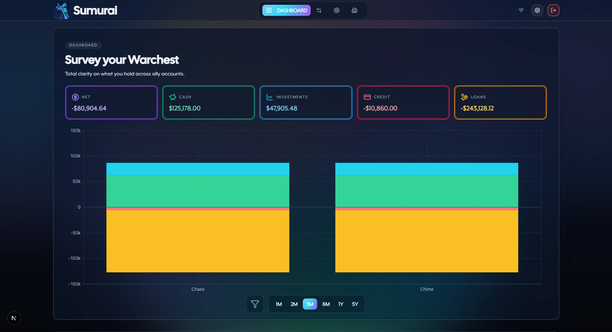
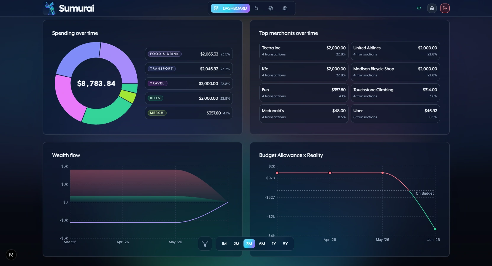
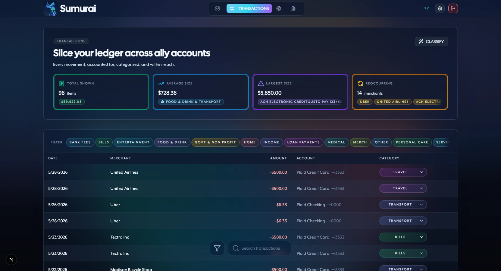
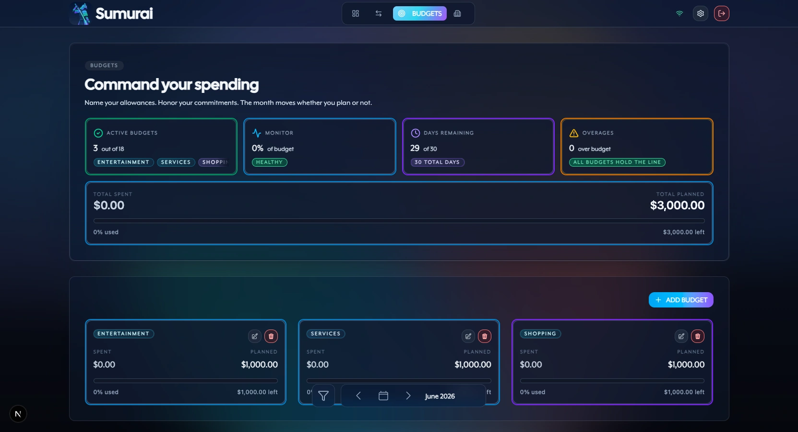
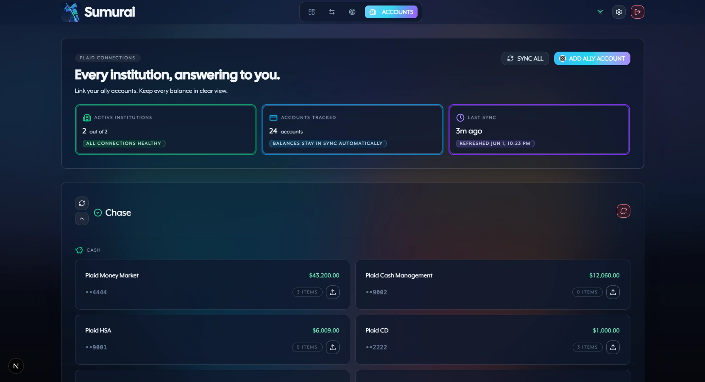

# Sumurai

Personal finance dashboard. Self-hosted. Connects to your bank via Teller, Plaid, or SimpleFIN, syncs transactions, and shows where your money goes.


## Why This Exists

Sumurai exists because there are not a lot of free, simple, and modern budgeting apps out there. We wanted a Bring Your Own Key (BYOK) self-hosted option that people can build a community around and decide its direction.

## What It Does

- Connects accounts through Teller, Plaid, or SimpleFIN
- Syncs and categorizes transactions
- Tracks budgets by category
- Charts spending, balances, and net worth over time







## Which Financial Provider is Right for You?

Import your own data, or connect through an aggregator. For aggregators, check whether your bank is supported:

- [SimpleFIN institutions search](https://beta-bridge.simplefin.org/search-institutions)
- [Plaid US/Canada coverage](https://plaid.com/docs/institutions/) · [Plaid Europe coverage](https://plaid.com/docs/institutions/europe/)
- [Teller institutions search](https://teller.io/#:~:text=Thousands%20of%20supported%20institutions)

ℹ️ Sumurai never stores your bank login when using an aggregator. Pick the path that's right for you. Teller/Plaid require a developer account.


|          | Self          | Teller              | SimpleFIN            | Plaid                |
| -------- | ------------- | ------------------- | -------------------- | -------------------- |
| Focus    | Manual import | Budget Friendly     | Privacy First        | Turn Key             |
| Region   | Any           | US Only             | US, CA               | US, CA, UK, EU       |
| Cost     | Free          | Free                | $1.50/mo             | Pay/use              |
| Coverage | Any           | ~7,000 Institutions | ~16,000 Institutions | ~12,000 Institutions |
| Privacy  | Strongest     | Moderate            | Strong               | Broad                |


## Privacy Disclosure for 3rd Party Financial Aggregators

While this app is designed to handle your information securely after it is received, 3rd party aggregators still control how their own services collect and process your data. Sumurai uses external financial aggregation APIs, including Teller, Plaid, and (when available) SimpleFIN, to connect accounts and sync transactions. Using those services requires accepting their terms of service and privacy policies.

SimpleFIN security: [https://beta-bridge.simplefin.org/info/security](https://beta-bridge.simplefin.org/info/security)

Teller policy: [https://teller.io/legal](https://teller.io/legal)

Plaid policy: [https://plaid.com/legal/#consumers](https://plaid.com/legal/#consumers)

Review the provider trade-offs before connecting real financial accounts.

## Supported Transaction Categories

Sumurai normalizes transactions into these primary category buckets:

- `ENTERTAINMENT`
- `FOOD & DRINK`
- `MERCHANDISE`
- `SERVICES`
- `GOVT & NON PROFIT`
- `HOME`
- `INCOME`
- `LOAN PAYMENTS`
- `MEDICAL`
- `OTHER`
- `PERSONAL CARE`
- `BILLS`
- `TRANSFER IN`
- `TRANSFER OUT`
- `TRANSPORT`
- `TRAVEL`

## Quick Start

Set the required secrets in `[.env.example](.env.example)`, then choose one provider path.

### 1. Generate Shared Secrets

```bash
cp .env.example .env
```

Generate a secret for each of these values:

- `JWT_SECRET`
- `ENCRYPTION_KEY`
- `POSTGRES_PASSWORD`

```bash
openssl rand -hex 32
```

### 2. SimpleFIN (Bring your own token)

1. Open the [SimpleFIN Bridge](https://bridge.simplefin.org/) and create a bridge (or use the beta developer bridge for local trials).
2. Start the app:

```bash
docker compose -f docker-compose.dev.yml up -d --build
```

1. Sign in, choose SimpleFIN in the provider picker, and paste your setup token when prompted.

### 3. Teller (Recommended)

1. Follow the [Teller Quickstart](https://teller.io/docs/guides/quickstart).
2. Set `TELLER_APPLICATION_ID`.
3. Download your Teller client certificate and private key from the Teller dashboard, then place them at `.certs/teller/certificate.pem` and `.certs/teller/private_key.pem`.
4. Start the app:

```bash
docker compose up -d --build
```

### 4. Plaid (Challenging)

1. Follow the [Plaid Quickstart](https://plaid.com/docs/quickstart/).
2. Set `PLAID_CLIENT_ID` and `PLAID_SECRET`.
3. Use Plaid Sandbox for local testing. Plaid has no development environment, and production keys require Plaid review of your company, use case, and security process before real data access is granted.
4. Start the app:

```bash
docker compose up -d --build
```

Open [http://localhost:8080](http://localhost:8080).

See [CONTRIBUTING.md](CONTRIBUTING.md) for setup, validation, workflow details, and local demo or sandbox credentials.

## Supported Platforms

Sumurai is intended to run on any host where Docker Compose is available, including macOS, Linux, and Windows. For browser access, use a modern desktop browser such as Chrome, Edge, Firefox, or Safari.

### Trusted Local HTTPS

Use mkcert when you need the local stack over browser-trusted HTTPS:

```bash
./scripts/setup-local-https.sh
docker compose up -d --build
```

Open <https://localhost:8443>. The generated certificates live in `.certs/mkcert/` and are ignored by git.

For access from another device on your network, generate the certificate on the machine running Docker and include that machine's LAN address or local hostname:

```bash
LOCAL_HTTPS_HOSTS="$(hostname -I | awk '{print $1}') $(hostname -s).local" ./scripts/setup-local-https.sh
docker compose restart nginx
```

The device opening the site must also trust the Docker host's mkcert root CA. On the Docker host, find it with `mkcert -CAROOT`, then install `rootCA.pem` on the client device.

## Architecture

The app is a static Next.js export served by Nginx on port 8080, with `/api/*` and `/health` proxied to the Rust backend.

- Frontend: Next.js 16, React 19, TypeScript 6, Tailwind 4, Recharts 3, Biome 2, Bun, and browser OpenTelemetry (enabled per compose via `NEXT_PUBLIC_OTEL_*`)
- Backend: Rust 1.95, Axum, SQLx, Redis, PostgreSQL, JWT auth, provider integrations, and OpenTelemetry tracing (export mode is set per environment; production compose sends OTLP to Seq)
- Deployment: standalone Docker Compose files—default OSS (`docker-compose.yml`), local dev builds (`docker-compose.dev.yml`), or production with Seq (`docker-compose.prod.yml`); each includes nginx, frontend, backend, Postgres, and Redis
- Providers: Teller, Plaid, and SimpleFIN through a shared provider registry

See [docs/ARCHITECTURE.md](docs/ARCHITECTURE.md) for the deeper system breakdown.

## Security

Self-hosted. Data stays in your PostgreSQL database.

- Bank credentials are not stored directly
- Provider tokens are encrypted with AES-256-GCM
- Redis is required for sessions, cache, and rate limiting
- Production nginx TLS requires a publicly trusted certificate and renewal schedule
- Wipe local data with `docker compose down -v`

## Roadmap

- Financial reports and data export
- Balance and budget notifications
- Receipt uploads and search

## Contributing

See [CONTRIBUTING.md](CONTRIBUTING.md).

## License

Source available under the Sustainable Use License v1.0. See [LICENSE](LICENSE).