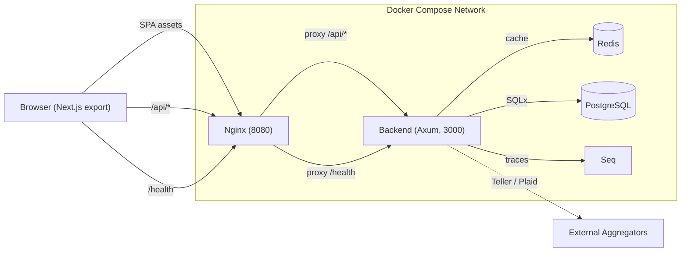

# Sumurai Architecture

This document describes the current runtime architecture, data flow, and major components in Sumurai. For setup and commands, see `README.md` and `CONTRIBUTING.md`.

## Overview

- Frontend: a static Next.js export built from `frontend/` and served by Nginx on port 8080.
- Backend: a Rust 1.95 Axum API in `backend/` with SQLx, JWT auth, Redis caching, and PostgreSQL persistence.
- Providers: Teller and Plaid are both supported through a shared provider registry.
- Observability: backend traces are exported to Seq; frontend includes browser telemetry hooks.
- Deployment: local and development workflows run through Docker Compose.

## Diagram

## End-to-End Data Flow

1. The browser loads the exported frontend through Nginx.
2. The frontend validates the session with the backend and keeps auth state synchronized.
3. When a user connects a provider, the frontend opens the provider-specific flow for Teller or Plaid.
4. The backend receives the provider token exchange, encrypts provider secrets, and stores them in PostgreSQL.
5. Sync services fetch accounts and transactions from the selected provider through the shared provider registry.
6. The backend normalizes transactions, updates the cache, and persists the latest state.
7. The dashboard reads analytics, budgets, and account data through `/api/*` endpoints.

## Provider Flow

- `DEFAULT_PROVIDER` determines the default provider shown by the app.
- The backend registers both Teller and Plaid implementations in a shared provider registry.
- The frontend uses provider-specific services and connect flows for Teller and Plaid.
- `/api/providers/info`, `/api/providers/status`, `/api/providers/accounts`, and `/api/providers/sync-transactions` support the provider management UX.
- Provider credentials are encrypted before persistence and invalidated through cache cleanup when a connection is removed.

## Frontend

- The frontend lives under `frontend/` and builds to a static `out/` directory.
- `frontend/src/App.tsx` coordinates authentication, onboarding, provider mismatch handling, and the authenticated app shell.
- `frontend/src/services/ApiClient.ts` centralizes API access with retry and auth refresh behavior.
- Provider-specific flows live in the frontend service and hook layer rather than in page components.
- OpenTelemetry instrumentation is configured in the browser and gated by `NEXT_PUBLIC_OTEL_*` flags.

## Backend

- `backend/src/main.rs` wires routes, middleware, providers, and shared application state.
- Business logic is separated into `backend/src/services/`.
- Domain models live in `backend/src/models/`.
- Tests live in `backend/src/tests/`.
- Middleware covers auth, IP banning, resource authorization, and telemetry.
- The backend uses Axum, SQLx, Redis, PostgreSQL, JWT access tokens, and OpenTelemetry export to Seq.

## API Proxy

- Nginx serves the static frontend assets.
- Nginx proxies `/api/*` and `/health` to the backend container.
- The runtime container listens on port 8080 for the user-facing app.

## Caching

Redis is required for sessions, rate limiting, and request caches.

Current cache lifetimes in code:

- JWT/session validity follows the remaining JWT TTL
- Provider access tokens: 1 hour
- Account and bank connection metadata: 2 hours
- Recent transaction sync cache: 30 minutes

Cache keys are namespaced by session, connection, and account identifiers so provider data stays isolated per user and connection.

## Database

- PostgreSQL stores users, accounts, transactions, budgets, provider connections, provider credentials, onboarding state, and related metadata.
- Migrations are applied with `sqlx migrate`.
- Row-level security enforces tenant isolation at the database layer.

## Multi-Tenancy

- The backend sets the authenticated user context after JWT validation.
- PostgreSQL RLS policies restrict reads and writes to the current user.
- The application role is not intended to bypass RLS.
- Redis cache keys are scoped to the session and provider context to prevent cross-user leakage.

## Development URLs

- Use `http://localhost:8080` for integrated validation through Nginx.
- Use `http://localhost:3001` for frontend-only development.
