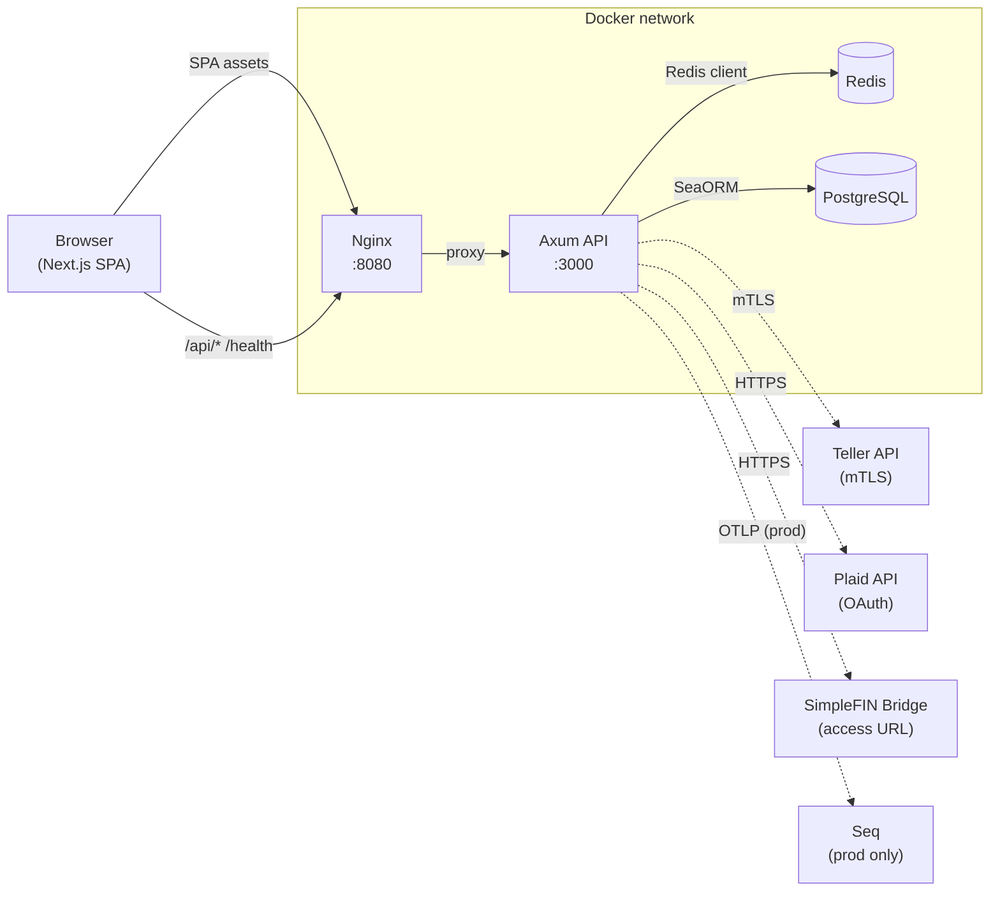
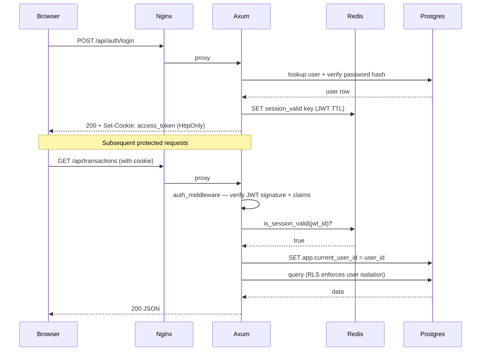
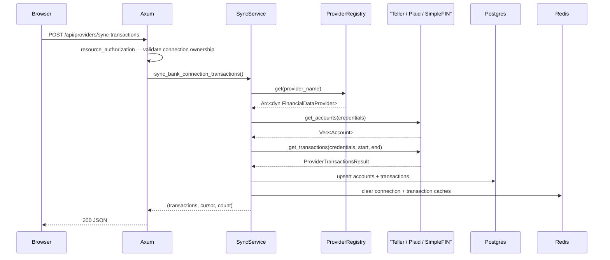
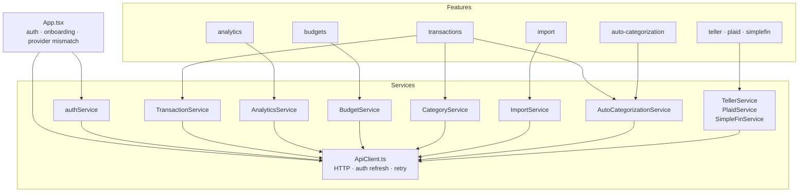
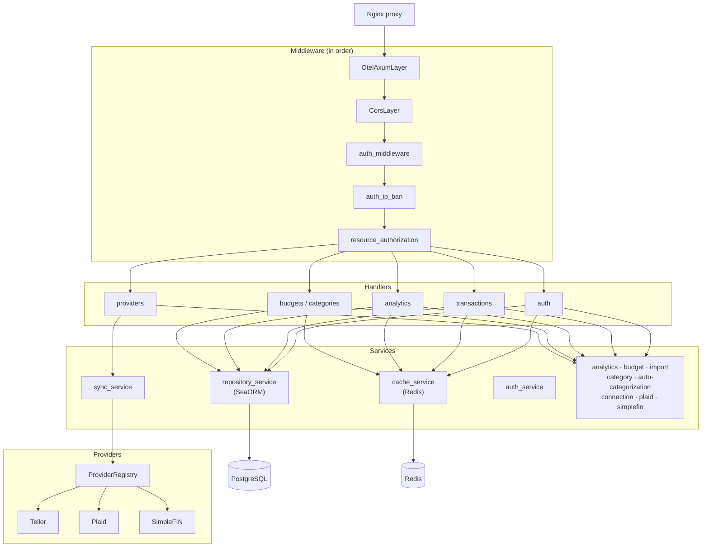
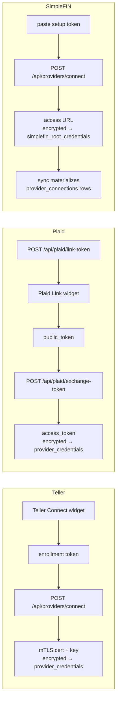
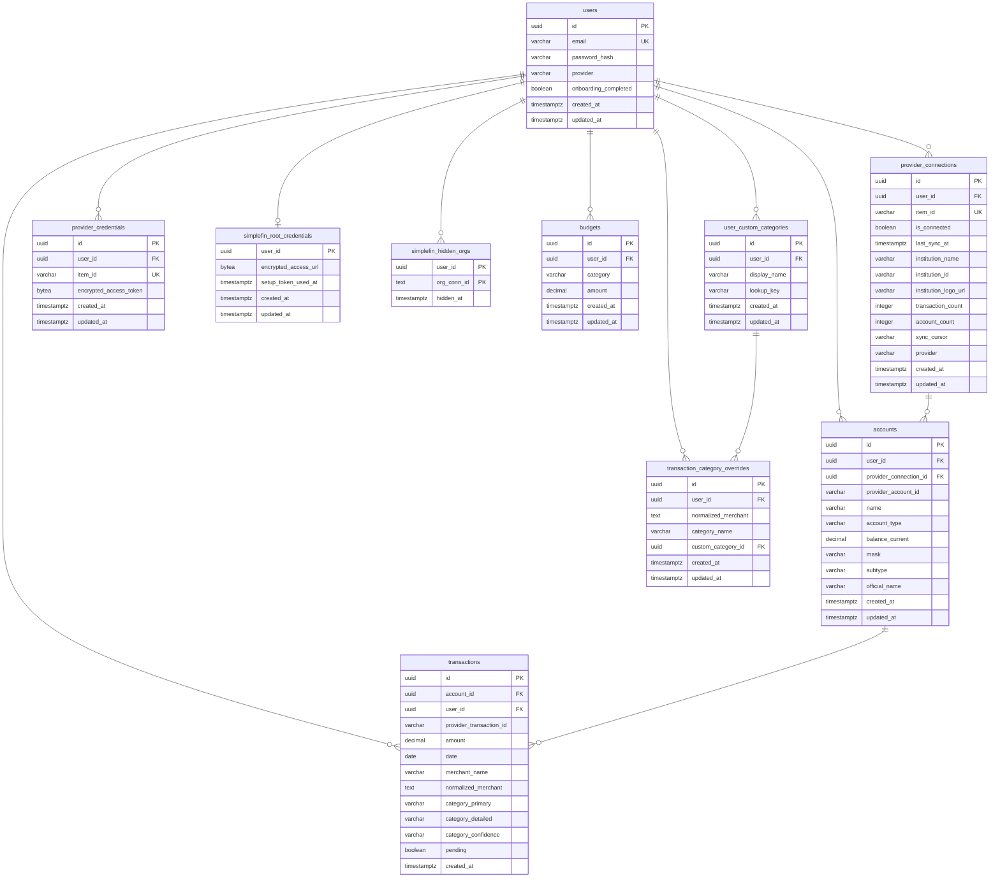

# Sumurai Architecture

Authoritative reference for runtime architecture, data flow, API surface, caching, and database schema. For setup and env vars see `CONTRIBUTING.md`. For design tokens see `DESIGN.md`. For agent guardrails see `AGENTS.md`.

---

## Overview

Sumurai is a personal finance aggregator. Users connect one financial provider (Teller, Plaid, or SimpleFIN); the app syncs accounts and transactions, and provides analytics and budgets.

```mermaid
flowchart LR
    Browser["Browser\n(Next.js SPA)"]

    subgraph "Docker network"
        Nginx["Nginx\n:8080"]
        Backend["Axum API\n:3000"]
        Redis[("Redis")]
        Postgres[("PostgreSQL")]
    end

    Teller["Teller API\n(mTLS)"]
    Plaid["Plaid API\n(OAuth)"]
    SimpleFIN["SimpleFIN Bridge\n(access URL)"]
    Seq["Seq\n(prod only)"]

    Browser -->|"SPA assets"| Nginx
    Browser -->|"/api/*  /health"| Nginx
    Nginx -->|"proxy"| Backend
    Backend -->|"SeaORM"| Postgres
    Backend -->|"Redis client"| Redis
    Backend -.->|"OTLP (prod)"| Seq
    Backend -.->|"mTLS"| Teller
    Backend -.->|"HTTPS"| Plaid
    Backend -.->|"HTTPS"| SimpleFIN
```

- **Frontend** — Next.js static export served by Nginx on port 8080.
- **Backend** — Rust/Axum API on port 3000 (internal), behind Nginx proxy.
- **Providers** — Teller, Plaid, and SimpleFIN via a shared provider registry.
- **Persistence** — PostgreSQL with row-level security; Redis for sessions, caching, and rate-limiting.
- **Observability** — OpenTelemetry end-to-end; export target (`none` / `console` / OTLP to Seq) set by `OTEL_TRACES_EXPORTER`.

Three standalone Compose files at the repo root (`docker-compose.yml`, `docker-compose.dev.yml`, `docker-compose.prod.yml`) — pick one, no merge overrides needed.

---

## Data Flow

### Authentication

```mermaid
sequenceDiagram
    participant Browser
    participant Nginx
    participant Axum
    participant Redis
    participant Postgres

    Browser->>Nginx: POST /api/auth/login
    Nginx->>Axum: proxy
    Axum->>Postgres: lookup user + verify password hash
    Postgres-->>Axum: user row
    Axum->>Redis: SET session_valid key (JWT TTL)
    Axum-->>Browser: 200 + Set-Cookie: access_token (HttpOnly)

    Note over Browser,Axum: Subsequent protected requests

    Browser->>Nginx: GET /api/transactions (with cookie)
    Nginx->>Axum: proxy
    Axum->>Axum: auth_middleware — verify JWT signature + claims
    Axum->>Redis: is_session_valid(jwt_id)?
    Redis-->>Axum: true
    Axum->>Postgres: SET app.current_user_id = user_id
    Axum->>Postgres: query (RLS enforces user isolation)
    Postgres-->>Axum: data
    Axum-->>Browser: 200 JSON
```

### Provider Sync

```mermaid
sequenceDiagram
    participant Browser
    participant Axum
    participant SyncService
    participant ProviderRegistry
    participant Provider as "Teller / Plaid / SimpleFIN"
    participant Postgres
    participant Redis

    Browser->>Axum: POST /api/providers/sync-transactions
    Axum->>Axum: resource_authorization — validate connection ownership
    Axum->>SyncService: sync_bank_connection_transactions()
    SyncService->>ProviderRegistry: get(provider_name)
    ProviderRegistry-->>SyncService: Arc<dyn FinancialDataProvider>
    SyncService->>Provider: get_accounts(credentials)
    Provider-->>SyncService: Vec<Account>
    SyncService->>Provider: get_transactions(credentials, start, end)
    Provider-->>SyncService: ProviderTransactionsResult
    SyncService->>Postgres: upsert accounts + transactions
    SyncService->>Redis: clear connection + transaction caches
    SyncService-->>Axum: (transactions, cursor, count)
    Axum-->>Browser: 200 JSON
```

---

## Frontend

Next.js static export — no SSR at runtime. All HTTP goes through `ApiClient.ts`, which owns auth-refresh and retry. Provider-specific logic lives in the service and hook layer, not in page components.

```mermaid
flowchart TD
    App["App.tsx\nauth · onboarding · provider mismatch"]

    subgraph Services
        ApiClient["ApiClient.ts\nHTTP · auth refresh · retry"]
        AuthSvc["authService"]
        TxSvc["TransactionService"]
        AnalSvc["AnalyticsService"]
        BudgetSvc["BudgetService"]
        CatSvc["CategoryService"]
        ImportSvc["ImportService"]
        AutoCatSvc["AutoCategorizationService"]
        ProviderSvcs["TellerService\nPlaidService\nSimpleFinService"]
    end

    subgraph Features
        FTx["transactions"]
        FBudget["budgets"]
        FAnal["analytics"]
        FImport["import"]
        FProviders["teller · plaid · simplefin"]
        FAutoCat["auto-categorization"]
    end

    App --> AuthSvc & ApiClient
    FTx --> TxSvc & CatSvc & AutoCatSvc
    FBudget --> BudgetSvc
    FAnal --> AnalSvc
    FImport --> ImportSvc
    FProviders --> ProviderSvcs
    FAutoCat --> AutoCatSvc

    AuthSvc & TxSvc & AnalSvc & BudgetSvc & CatSvc & ImportSvc & AutoCatSvc & ProviderSvcs --> ApiClient
```

---

## Backend

Handlers → services → `repository_service` (SeaORM entities via `with_tenant`) / `cache_service` (Redis) / providers. Domain types in `models/`. Tests in `backend/src/tests/`.

```mermaid
flowchart TD
    Nginx["Nginx proxy"]

    subgraph Middleware["Middleware (in order)"]
        MW1["OtelAxumLayer"]
        MW2["CorsLayer"]
        MW3["auth_middleware"]
        MW4["auth_ip_ban"]
        MW5["resource_authorization"]
    end

    subgraph Handlers
        H1["auth"]
        H2["transactions"]
        H3["providers"]
        H4["analytics"]
        H5["budgets / categories"]
    end

    subgraph Services
        RepoSvc["repository_service\n(SeaORM)"]
        CacheSvc["cache_service\n(Redis)"]
        SyncSvc["sync_service"]
        AuthSvc["auth_service"]
        OtherSvcs["analytics · budget · import\ncategory · auto-categorization\nconnection · plaid · simplefin"]
    end

    subgraph Providers
        Registry["ProviderRegistry"]
        P1["Teller"]
        P2["Plaid"]
        P3["SimpleFIN"]
    end

    Nginx --> MW1 --> MW2 --> MW3 --> MW4 --> MW5
    MW5 --> H1 & H2 & H3 & H4 & H5

    H1 & H2 & H4 & H5 --> RepoSvc & CacheSvc & OtherSvcs
    H3 --> SyncSvc & OtherSvcs
    SyncSvc --> Registry --> P1 & P2 & P3
    RepoSvc --> Postgres[("PostgreSQL")]
    CacheSvc --> Redis[("Redis")]
```

### Container build

GHCR backend images are produced from the **repository root** with `backend/Dockerfile` (see `publish-images` workflow). The image targets a Cargo **workspace** whose root manifest and lockfile live at `Cargo.toml` and `Cargo.lock`; members are `backend` (Axum API), `backend/entity` (SeaORM entities), and `backend/migration` (SeaORM migrations).

Docker builds use **cargo-chef** so dependency layers stay cached when only application source changes:

| Stage | Role |
|-------|------|
| `planner` | Workspace manifests + stubs → `cargo chef prepare` → `recipe.json` |
| `builder` | `cargo chef cook` (deps) → copy `backend/` → `cargo build -p sumurai-backend -p migration` |
| `assets` | ONNX runtime + Hugging Face model artifacts (verified by checksum) |
| `runtime` | Debian slim + `sumurai-backend`, `migration` CLI, `docker-entrypoint.sh` |

The runtime container runs `docker-migrate.sh` then starts the API; see **Database Schema** for migration layout.

### Middleware stack (applied in order)

1. `OtelAxumLayer` — trace context propagation
2. `CorsLayer`
3. `auth_middleware` — JWT verification, Redis session-valid check, injects `app.current_user_id`
4. `auth_ip_ban` — failed-login rate-limit and IP ban via Redis
5. `resource_authorization` — validates connection and budget ownership before handlers run

---

## Provider System

Every provider implements `FinancialDataProvider` and registers by name in `providers/registry.rs` at startup. **Never branch on provider name in handlers or services** — resolve through the registry and extend the trait instead.

### Connect flows

```mermaid
flowchart LR
    subgraph Teller
        direction TB
        T1["Teller Connect widget"] --> T2["enrollment token"]
        T2 --> T3["POST /api/providers/connect"]
        T3 --> T4["mTLS cert + key\nencrypted → provider_credentials"]
    end

    subgraph Plaid
        direction TB
        P1["POST /api/plaid/link-token"] --> P2["Plaid Link widget"]
        P2 --> P3["public_token"]
        P3 --> P4["POST /api/plaid/exchange-token"]
        P4 --> P5["access_token\nencrypted → provider_credentials"]
    end

    subgraph SimpleFIN
        direction TB
        S1["paste setup token"] --> S2["POST /api/providers/connect"]
        S2 --> S3["access URL\nencrypted → simplefin_root_credentials"]
        S3 --> S4["sync materializes\nprovider_connections rows"]
    end
```

### SimpleFIN specifics

- One access URL backs many `provider_connections` rows — each institution in the bridge snapshot gets its own row keyed by `simplefin_{org_conn_id}`.
- `simplefin_hidden_orgs` records disconnected orgs. Sync skips blocklisted `org_conn_id` values so they never produce new rows in `provider_connections`, `accounts`, or `transactions`.
- Manual sync is rate-limited to once per hour per user (Redis floor key).
- Disconnecting the last SimpleFIN institution removes the access URL and clears the ignore list — next connect requires a fresh setup token.

---

## API Routes

### Public

| Method | Path |
|--------|------|
| GET | `/health` |
| POST | `/api/auth/register` |
| POST | `/api/auth/login` |
| POST | `/api/auth/refresh` |
| POST | `/api/auth/logout` |

### Protected (JWT cookie required)

**Auth**

| Method | Path |
|--------|------|
| POST | `/api/auth/onboarding/complete` |
| DELETE | `/api/auth/account` |

**Transactions**

| Method | Path |
|--------|------|
| GET | `/api/transactions` |
| PUT | `/api/transactions/{id}/category` |
| GET | `/api/transactions/insights` |
| GET | `/api/transactions/categories` |
| POST/GET/DELETE | `/api/transactions/auto-categorize` |
| POST | `/api/transactions/import/validate` |
| POST | `/api/transactions/import` |

**Categories**

| Method | Path |
|--------|------|
| GET | `/api/categories` |
| POST | `/api/categories/custom` |
| PUT/DELETE | `/api/categories/custom/{id}` |

**Providers**

| Method | Path |
|--------|------|
| GET | `/api/providers/info` |
| POST | `/api/providers/select` |
| POST/GET | `/api/providers/connect` |
| GET | `/api/providers/status` |
| GET | `/api/providers/accounts` |
| POST | `/api/providers/sync-transactions` |
| POST | `/api/providers/disconnect` |
| GET/DELETE | `/api/providers/simplefin/ignored-institutions` |
| POST | `/api/plaid/link-token` |
| POST | `/api/plaid/exchange-token` |
| GET | `/api/plaid/accounts` |
| POST | `/api/plaid/clear-synced-data` |

**Analytics**

| Method | Path |
|--------|------|
| GET | `/api/analytics/spending/current-month` |
| GET | `/api/analytics/spending` |
| GET | `/api/analytics/daily-spending` |
| GET | `/api/analytics/categories` |
| GET | `/api/analytics/monthly-totals` |
| GET | `/api/analytics/top-merchants` |
| GET | `/api/analytics/balances/overview` |
| GET | `/api/analytics/net-worth-over-time` |

**Budgets**

| Method | Path |
|--------|------|
| GET/POST | `/api/budgets` |
| PUT/DELETE | `/api/budgets/{id}` |

---

## Caching

All Redis access goes through `cache_service.rs`. TTL constants are at the top of that file — update them there and here together.

| Cache Key Pattern | TTL | Invalidated When |
|-------------------|-----|-----------------|
| `{jwt_id}_session_valid` | Remaining JWT TTL | Logout or expiry |
| `{jwt_id}_{item_id}_access_token` | 3600 s (1 h) | Provider disconnect |
| `{jwt_id}_bank_connection_{conn_id}` | 7200 s (2 h) | Sync or disconnect |
| `{jwt_id}_bank_accounts_{conn_id}` | 7200 s (2 h) | Sync or disconnect |
| `{jwt_id}_synced_transactions` | 1800 s (30 min) | Sync completes |
| `{jwt_id}_budgets` | 300 s (5 min) | Budget create / update / delete |
| `auth_rate_limit_{ip}` | per policy | — |
| `auth_ip_ban_{ip}` | per policy | — |

All keys are scoped to `jwt_id`. There are no cross-user keys.

---

## Multi-Tenancy & Security

- `auth_middleware` sets `app.current_user_id` on the Postgres connection before every query. RLS policies on every user-scoped table enforce `USING (user_id = current_setting('app.current_user_id', true)::uuid)` — isolation holds even if application code omits a `WHERE user_id` clause.
- The app role cannot bypass RLS. Do not write queries that assume superuser access.
- `resource_authorization` middleware validates connection and budget ownership before handlers run.
- Redis keys are namespaced by `jwt_id` — never use a global key for user data.
- Provider credentials are AES-GCM encrypted before persistence (`utils/encryption_key.rs`).

---

## Database Schema

Migrations live in [`backend/migration/`](../backend/migration/) and are applied when the backend container starts: `backend/scripts/docker-migrate.sh` handles legacy SQLx cutover (snapshot, data export, SeaORM schema, restore), then `Migrator::up` in [`backend/src/main.rs`](../backend/src/main.rs) applies incremental migrations. Generated table mappings are in [`backend/entity/`](../backend/entity/). Repository code uses the entity DSL; raw SQL via `Statement::from_sql_and_values` is a deliberate escape hatch for joins/aggregates the DSL cannot express. RLS tenant context (`set_config('app.current_user_id', …)`) is unchanged in behavior — it is centralized in `backend/src/utils/tenant_context.rs` and invoked through `PostgresRepository::with_tenant`.

```mermaid
erDiagram
    users {
        uuid id PK
        varchar email UK
        varchar password_hash
        varchar provider
        boolean onboarding_completed
        timestamptz created_at
        timestamptz updated_at
    }
    provider_connections {
        uuid id PK
        uuid user_id FK
        varchar item_id UK
        boolean is_connected
        timestamptz last_sync_at
        varchar institution_name
        varchar institution_id
        varchar institution_logo_url
        integer transaction_count
        integer account_count
        varchar sync_cursor
        varchar provider
        timestamptz created_at
        timestamptz updated_at
    }
    provider_credentials {
        uuid id PK
        uuid user_id FK
        varchar item_id UK
        bytea encrypted_access_token
        timestamptz created_at
        timestamptz updated_at
    }
    simplefin_root_credentials {
        uuid user_id PK
        bytea encrypted_access_url
        timestamptz setup_token_used_at
        timestamptz created_at
        timestamptz updated_at
    }
    simplefin_hidden_orgs {
        uuid user_id PK
        text org_conn_id PK
        timestamptz hidden_at
    }
    accounts {
        uuid id PK
        uuid user_id FK
        uuid provider_connection_id FK
        varchar provider_account_id
        varchar name
        varchar account_type
        decimal balance_current
        varchar mask
        varchar subtype
        varchar official_name
        timestamptz created_at
        timestamptz updated_at
    }
    transactions {
        uuid id PK
        uuid account_id FK
        uuid user_id FK
        varchar provider_transaction_id
        decimal amount
        date date
        varchar merchant_name
        text normalized_merchant
        varchar category_primary
        varchar category_detailed
        varchar category_confidence
        boolean pending
        timestamptz created_at
    }
    budgets {
        uuid id PK
        uuid user_id FK
        varchar category
        decimal amount
        timestamptz created_at
        timestamptz updated_at
    }
    user_custom_categories {
        uuid id PK
        uuid user_id FK
        varchar display_name
        varchar lookup_key
        timestamptz created_at
        timestamptz updated_at
    }
    transaction_category_overrides {
        uuid id PK
        uuid user_id FK
        text normalized_merchant
        varchar category_name
        uuid custom_category_id FK
        timestamptz created_at
        timestamptz updated_at
    }

    users ||--o{ provider_connections : ""
    users ||--o{ provider_credentials : ""
    users ||--o| simplefin_root_credentials : ""
    users ||--o{ simplefin_hidden_orgs : ""
    users ||--o{ accounts : ""
    users ||--o{ transactions : ""
    users ||--o{ budgets : ""
    users ||--o{ user_custom_categories : ""
    users ||--o{ transaction_category_overrides : ""
    provider_connections ||--o{ accounts : ""
    accounts ||--o{ transactions : ""
    user_custom_categories ||--o{ transaction_category_overrides : ""
```

---

## Development URLs

| URL | Use |
|-----|-----|
| `http://localhost:8080` | Full stack through Nginx — **use for validation** |
| `http://localhost:3001` | Next.js dev server (HMR only) — bypasses Nginx, won't catch proxy/auth issues |
| `http://localhost:8080/scalar` | API docs UI |
| `http://localhost:8080/api-docs/openapi.json` | Raw OpenAPI spec |
