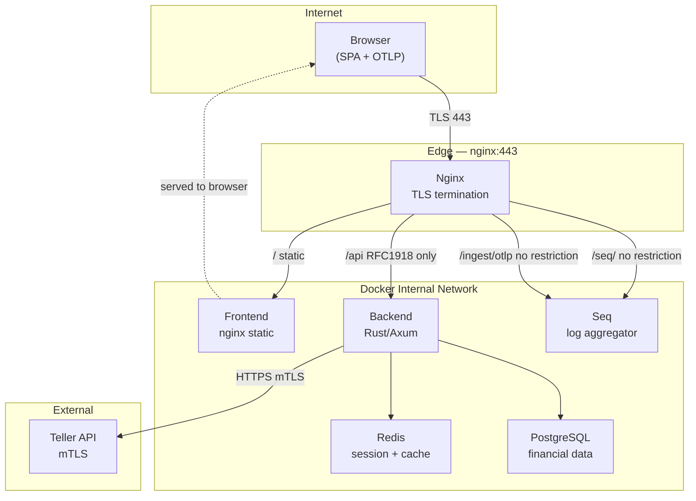

# Sumurai Threat Model

## Executive Summary

The most critical risk concentration is the complete absence of rate limiting on authentication endpoints combined with token storage in `sessionStorage` (no httpOnly cookies) and no Content Security Policy — together forming a high-confidence path from credential stuffing or XSS to full account takeover. For a multi-tenant financial SaaS, two cross-tenant bugs stand out: a **global (non-user-scoped) `synced_transactions` Redis key** that any authenticated user's logout/sync can wipe for all tenants, and **authorization that is fully per-handler with no centralized ownership gate**, where a single missed check creates cross-tenant financial data exposure. Infrastructure gaps (Seq UI and OTLP ingestion publicly proxied without IP restriction and no HSTS/CSP/XFO at the nginx layer) round out the surface area requiring immediate attention before production deployment.

---

## Scope and Assumptions

**In scope:** `backend/`, `frontend/`, `nginx/`, `docker-compose.yml`, `.github/workflows/`, `backend/migrations/`

**Out of scope:** Teller's own platform security; Plaid (not active in production); third-party CDN uptime.

**Confirmed context:**

- Currently running locally; production deployment target is multi-tenant public SaaS
- Financial data provider: Teller only (mTLS client certificate)
- Tenancy: multi-tenant SaaS (multiple unrelated users sharing one deployment)

**Open questions that would refine rankings:**

- Does production Redis require authentication (`requirepass`) or is it open on the Docker network?
- Is `ENCRYPTION_KEY` injected only via a secrets manager in each environment (no reuse across staging and production), and is rotation defined for compromise scenarios?
- Is the Seq UI intended to be publicly accessible in production or only for operators?

---

## System Model

### Primary Components

- **Frontend** — Next.js static export (`output: 'export'`), SPA. No SSR, no Next.js API routes. Served by nginx.
- **Backend** — Rust/Axum HTTP API. JWT+Redis session auth. SQLx/Postgres for persistence. AES-256-GCM for Teller token encryption. OTLP traces to Seq.
- **Nginx** — TLS termination, reverse proxy. `/api` gated to RFC1918 only. `/seq/` and `/ingest/otlp` unrestricted.
- **PostgreSQL** — Primary data store. Row-level security via `app.current_user_id` session variable. Teller access tokens stored as AES-256-GCM encrypted BYTEA.
- **Redis** — Session validity flags, JWT strings, per-JWT-scoped cache, and one **global** `synced_transactions` key.
- **Teller API** — External financial data provider. Backend connects via HTTPS + mTLS using a client certificate mounted as a read-only volume.
- **Seq** — Structured log/trace aggregator. OTLP ingestion at `/ingest/otlp` (10 MB body). UI at `/seq/`.

### Data Flows and Trust Boundaries

- **Browser → Nginx (TLS 1.2/1.3, port 443)**
  - Data: HTML/JS assets, API requests with `Authorization: Bearer` header, OTLP spans (browser telemetry)
  - Auth: TLS only at this boundary; JWT validated downstream
  - Validation: none at proxy layer; no WAF, no rate limiting, no schema enforcement
- **Nginx → Backend (HTTP, Docker internal network; `/api` RFC1918-gated)**
  - Data: authenticated API requests, JSON bodies
  - Auth: `X-Forwarded-For` propagated; backend trusts this header for logging
  - Validation: `remote_addr` must be RFC1918 — effectively limits direct public access to `/api`
- **Nginx → Seq UI and OTLP (HTTP, Docker internal; no IP restriction)**
  - Data: structured logs/traces, Seq admin UI
  - Auth: none enforced at proxy; Seq's own auth (if configured) is the only gate
  - Note: publicly reachable on port 8443 — same vhost, different location blocks
- **Backend → PostgreSQL (TCP, Docker internal)**
  - Data: user records, transactions, budgets, encrypted Teller tokens
  - Auth: `DATABASE_URL` credential; no TLS in compose config (internal Docker network)
  - Validation: parameterized `sqlx` queries throughout; RLS via `set_config('app.current_user_id',...)`
- **Backend → Redis (TCP, Docker internal)**
  - Data: session flags, full JWT strings, per-user-scoped cache blobs, one global transaction list
  - Auth: no `requirepass` shown in compose; Redis open on Docker network
- **Backend → Teller API (HTTPS, external)**
  - Data: financial account/transaction requests
  - Auth: mTLS client certificate (backend reads `/etc/teller/certificate.pem` and `/etc/teller/private_key.pem`; Docker bind-mounts from host `TELLER_CERT_PATH` / `TELLER_KEY_PATH`)
  - Validation: Teller enforces API-key scoping per application

#### Diagram

---

## Assets and Security Objectives

| Asset                                        | Why it matters                                                    | Objective |
| -------------------------------------------- | ----------------------------------------------------------------- | --------- |
| Teller access tokens (encrypted in Postgres) | Full read access to user's bank accounts via Teller API           | C, I      |
| `ENCRYPTION_KEY` (AES-256-GCM key)           | Decrypts all Teller tokens in DB; single point of compromise      | C         |
| `JWT_SECRET` (HS256 signing key)             | Forge arbitrary JWTs for any user without needing credentials     | C, I      |
| Teller mTLS private key                      | Impersonate the application to Teller for any user                | C, I      |
| User credentials (email + Argon2 hash)       | Account takeover if hash cracked; email is PII                    | C         |
| Financial transaction data                   | Sensitive PII; GDPR/CCPA scope; user harm if exposed cross-tenant | C         |
| Redis session state                          | Session hijack or mass session invalidation (DoS)                 | C, I, A   |
| Seq telemetry (traces with email PII)        | Regulatory exposure; attacker insight into system behavior        | C         |
| JWT access tokens (in `sessionStorage`)      | XSS-stealable; grants full API access for 24h                     | C         |

---

## Attacker Model

### Capabilities

- Unauthenticated remote attacker with network access to nginx:8443
- Authenticated attacker (registered account, valid session)
- Script-kiddie to intermediate skill; automated tooling (credential stuffing, fuzzing)
- Malicious PR author (GitHub Actions surface)

### Non-capabilities

- Attacker cannot directly reach PostgreSQL, Redis, or the Backend API without going through nginx (Docker internal network; `/api` RFC1918-restricted at nginx)
- Attacker cannot read Teller access tokens from DB without both DB access AND `ENCRYPTION_KEY`
- Attacker cannot directly forge JWTs without `JWT_SECRET`
- Attacker does not have physical/hypervisor access to the host

---

## Entry Points and Attack Surfaces

| Surface                                | How reached                                | Trust boundary                       | Notes                                             | Evidence                                                                                                      |
| -------------------------------------- | ------------------------------------------ | ------------------------------------ | ------------------------------------------------- | ------------------------------------------------------------------------------------------------------------- |
| `POST /api/auth/login`                 | Public router (nginx RFC1918 gate)         | Internet → Nginx → Backend           | No rate limit                                     | `backend/src/main.rs:~560`                                                                                    |
| `POST /api/auth/register`              | Public router                              | Internet → Nginx → Backend           | No rate limit; email logged on failure            | `backend/src/main.rs:~490`                                                                                    |
| `POST /api/auth/refresh`               | Public router; handler validates Bearer    | Internet → Nginx → Backend           | 300s leeway on JWT expiry                         | `backend/src/main.rs:~703`                                                                                    |
| `POST /api/auth/logout`                | Public router                              | Internet → Nginx → Backend           | Skips `auth_middleware` session gate              | `backend/src/main.rs:~650`                                                                                    |
| `/api-docs/openapi.json`, `/scalar`    | Public (docs router; not RFC1918-gated)    | Internet → Nginx → Backend           | Schema/endpoint enumeration                       | `backend/src/main.rs:~334`                                                                                    |
| `/seq/`                                | Public nginx proxy location                | Internet → Nginx → Seq               | No IP restriction; Seq UI exposure                | `nginx/nginx.conf.template`                                                                                   |
| `POST /ingest/otlp`                    | Public nginx location; 10 MB body          | Internet → Nginx → Seq               | No auth; telemetry flood vector                   | `nginx/nginx.conf.template`                                                                                   |
| Browser OTLP exporter                  | Browser sends spans to `/ingest/otlp`      | Browser → Nginx → Seq                | Non-PII auth span attributes                     | `frontend/src/services/authService.ts:54`                                                                     |
| `sessionStorage`                       | XSS in the SPA                             | Browser (same-origin)                | Access + refresh tokens stored; no httpOnly       | `frontend/src/services/boundaries/BrowserStorageAdapter.ts:3`                                                 |
| Third-party scripts                    | `https://cdn.teller.io/connect/connect.js` | External CDN → Browser               | No CSP; script executes in page context           | `frontend/src/hooks/useTellerConnect.ts`                                                                      |
| `pull_request_target` CI               | Fork PR → GitHub Actions                   | GitHub → Repo secrets                | Runs with write perms in base context             | `.github/workflows/semantic-pr.yml`                                                                           |
| Redis global key `synced_transactions` | Authenticated API call by any user         | Authenticated user → Backend → Redis | Not user-scoped; any user's sync/logout clears it | `backend/src/services/cache_service.rs`                                                                       |
| Missing or invalid `ENCRYPTION_KEY`    | Deploy without valid 64-hex secret         | Operator misconfiguration            | Backend exits at startup; no silent default key   | `backend/src/main.rs` (`std::env::var` + `parse_encryption_key_hex` in `backend/src/utils/encryption_key.rs`) |

---

## Top Abuse Paths

1. **Credential stuffing → account takeover:** Attacker fires automated login attempts against `POST /api/auth/login` with breached credential lists. No rate limiting, no CAPTCHA, no lockout → valid credentials accepted → full financial data access.
2. **XSS via CDN supply chain → token exfiltration:** Third-party Teller CDN script (`https://cdn.teller.io/connect/connect.js`) loads in the page with no CSP. If CDN is compromised or the script is injected, it reads `sessionStorage` for `auth_token` and `refresh_token` and exfiltrates them → 24h API access to financial data.
3. **Cross-tenant transaction cache wipe (DoS):** Authenticated attacker calls `POST /api/providers/sync-transactions` or logs out → backend calls `clear_transactions()` on the global `synced_transactions` Redis key → all other tenants lose their cached transaction lists simultaneously → performance degradation or stale data on next load.
4. **Misconfigured deployment → service unavailable or weak key hygiene:** Operator omits or mis-types `ENCRYPTION_KEY` → backend fails fast at startup (no silent default). Residual risk: a reused, committed, or leaked `ENCRYPTION_KEY` still enables decryption of `encrypted_access_token` values if the database is dumped.
5. **OTLP flood / Seq poisoning:** Unauthenticated attacker posts large payloads to `/ingest/otlp` (10 MB limit, no rate limiting, no auth) → Seq disk fills or becomes overwhelmed → log and trace data lost, creating a detection blind spot, or Seq becomes unavailable.
6. **Seq UI data exposure:** Seq UI at `/seq/` is publicly proxied without IP restriction. If Seq auth is not configured or is weak, an attacker browses all structured logs and traces, so any regression that reintroduces email PII into auth spans or backend logs would be exposed quickly.
7. `**pull_request_target` supply chain attack:** Malicious PR from a fork triggers `semantic-pr.yml` with `pull_request_target`. The workflow runs in the base branch context with `pull-requests: write`. If PR head code is checked out within a step, injected code can exfiltrate secrets or modify repository state.
8. **Missing per-handler authZ check → cross-tenant data access:** A handler that omits `validate_account_ownership` (or equivalent) returns data scoped only by the authenticated JWT, not verified resource ownership. Attacker substitutes another user's resource ID (budget `id`, `connection_id`) in a PUT/GET request and receives or modifies that user's financial data.

---

## Threat Model Table

| Threat ID | Threat source                       | Prerequisites                                                                                 | Threat action                                                                                | Impact                                                                                             | Impacted assets                                          | Existing controls (evidence)                                                                                                                                                                                                                                | Gaps                                                                                                                                                                                             | Recommended mitigations                                                                                                                                                                                | Detection ideas                                                                                                | Likelihood | Impact severity | Priority   |
| --------- | ----------------------------------- | --------------------------------------------------------------------------------------------- | -------------------------------------------------------------------------------------------- | -------------------------------------------------------------------------------------------------- | -------------------------------------------------------- | ----------------------------------------------------------------------------------------------------------------------------------------------------------------------------------------------------------------------------------------------------------- | ------------------------------------------------------------------------------------------------------------------------------------------------------------------------------------------------ | ------------------------------------------------------------------------------------------------------------------------------------------------------------------------------------------------------ | -------------------------------------------------------------------------------------------------------------- | ---------- | --------------- | ---------- |
| TM-001    | Unauthenticated remote attacker     | Network access to nginx:8443                                                                  | Credential stuffing / brute-force `POST /api/auth/login`                                     | Mass account takeover; full financial data exposure                                                | User credentials, Teller access tokens, financial data   | Argon2 hashing (`backend/src/services/auth_service.rs:27`); JWT+Redis sessions; `tower-governor` on auth routes; progressive Redis lockout on backend-observed 429; nginx loose volumetric `limit_req` on `/api/auth` (edge 429 does not increment strikes) | IP keys still follow `SmartIpKeyExtractor` / `X-Forwarded-For` trust model; no CAPTCHA                                                                                                           | Use edge-set trusted client IP (e.g. `X-Real-IP`) for governor and lockout keys; optional CAPTCHA or proof-of-work after repeated failures                                                             | Alert on >10 failed logins per IP/min in Seq; track `auth_result=failure` metric                               | High       | High            | **High**   |
| TM-002    | Authenticated attacker (any tenant) | Valid registered account                                                                      | Trigger sync or logout to invoke `clear_transactions()` on global Redis key                  | All tenants lose cached transaction data; next load hits DB/Teller (availability + data integrity) | Redis cache, transaction data availability               | JWT+Redis session auth required to call endpoint                                                                                                                                                                                                            | `synced_transactions` key is not user-scoped (`backend/src/services/cache_service.rs`)                                                                                                           | Namespace the key: `synced_transactions:{user_id}`; scope all cache ops to the requesting user                                                                                                         | Alert on rapid repeated sync calls from a single user; monitor cache miss rate spikes                          | Medium     | High            | **High**   |
| TM-003    | XSS or CDN supply chain compromise  | No CSP; Teller CDN script loaded without integrity check                                      | Malicious script reads `sessionStorage` → exfiltrates `auth_token` + `refresh_token`         | Full account takeover for 24h; financial data access via API                                       | JWT access tokens, refresh tokens, Teller account access | `sessionStorage` (tab-scoped, not `localStorage`)                                                                                                                                                                                                           | No CSP (`next.config.js`, `nginx/nginx.conf.template`); no httpOnly cookie; `sessionStorage` is fully JS-readable (`frontend/src/services/boundaries/BrowserStorageAdapter.ts:3`)                | Implement CSP with `script-src` allowlist at nginx; migrate tokens to `httpOnly Secure SameSite=Strict` cookies; add `integrity` SRI hash to Teller CDN script tag                                     | Monitor anomalous token reuse from different IPs or user-agents                                                | Medium     | High            | **High**   |
| TM-004    | Unauthenticated remote attacker     | Network access to port 8443                                                                   | POST large/malformed payloads to `/ingest/otlp`; browse Seq UI for PII                       | Seq DoS (log/trace blind spot); email PII leakage from traces                                      | Seq telemetry, email PII, operational observability      | 10 MB body limit; nginx client timeout                                                                                                                                                                                                                      | No auth on OTLP endpoint; no IP restriction on `/seq/` or `/ingest/otlp`; no rate limit (`nginx/nginx.conf.template`)                                                                            | Add RFC1918 `allow/deny` to `/seq/` and `/ingest/otlp` in nginx template; require Seq API key header at ingestion; add `limit_req` on `/ingest/otlp`                                                   | Alert on ingest body size spikes; monitor Seq disk usage                                                       | High       | High            | **High**   |
| TM-005    | Remote attacker / passive observer  | Access to public port 8443                                                                    | Abuse missing HSTS (protocol downgrade), clickjack via iframe, MIME-type confusion           | Session hijacking (if tokens move to cookies); clickjacking                                        | User sessions, token security                            | TLS 1.2/1.3 enforced; `ssl_prefer_server_ciphers off`                                                                                                                                                                                                       | No `Strict-Transport-Security`; no `X-Frame-Options`; no `X-Content-Type-Options`; no `Referrer-Policy` at nginx layer                                                                           | Add `add_header` block to nginx HTTPS server: `Strict-Transport-Security max-age=31536000; includeSubDomains`, `X-Frame-Options DENY`, `X-Content-Type-Options nosniff`, `Referrer-Policy no-referrer` | N/A (preventive)                                                                                               | Medium     | Medium          | **High**   |
| TM-006    | Operator misconfiguration           | Weak or leaked `ENCRYPTION_KEY`; historically missing env used a well-known default (removed) | Attacker with DB dump and key material decrypts stored Teller tokens                         | Mass decryption of Teller-backed access if key is predictable or leaked                            | Teller access tokens, `ENCRYPTION_KEY`                   | AES-256-GCM (`repository_service.rs`); required validated key at startup (`main.rs`, `utils/encryption_key.rs`); documented in `.env.example`                                                                                                               | Residual: key reuse across environments; secrets in compose backups; rotation after compromise                                                                                                   | Unique key per environment via secrets manager; never commit real keys; define rotation runbook                                                                                                        | Deploy pipeline alerts on process exit; structured log when key validates successfully (no key value)          | Low        | High            | **High**   |
| TM-007    | Authenticated attacker              | Valid account; knowledge of another user's resource ID                                        | Substitute another user's resource ID in API calls that lack ownership validation            | Cross-tenant financial data read or modification                                                   | Financial data, budget records, bank connections         | Per-handler ownership checks exist for some endpoints (e.g., `validate_account_ownership`)                                                                                                                                                                  | No centralized authZ layer; completeness is not enforced or tested across all handlers                                                                                                           | Audit all protected-route handlers for explicit ownership validation; add integration tests asserting cross-user ID rejection for every resource-parameterized endpoint                                | Monitor unexpected 200 responses on resource-ID-parameterized endpoints from users who don't own that resource | Medium     | High            | **High**   |
| TM-008    | Malicious fork PR author            | Open source / public repo; `pull_request_target` trigger                                      | Inject code into workflow running in base branch context; exfiltrate secrets or modify repo  | Supply chain compromise; secret exfiltration                                                       | CI secrets, repo write access                            | `permissions: contents: read` on CI workflow                                                                                                                                                                                                                | `pull_request_target` with `pull-requests: write` in `.github/workflows/semantic-pr.yml`; action pinned to tag not commit SHA                                                                    | Replace with `pull_request` trigger; or gate secrets/permissions behind `github.event.pull_request.head.repo.full_name == github.repository`; pin action to full commit SHA                            | GitHub audit log for unexpected workflow runs from forks                                                       | Low        | High            | **Medium** |
| TM-009    | Internal logging pipeline           | Any authenticated login                                                                       | Email PII could flow into OTLP spans or auth failure logs if regressions reintroduce it      | GDPR/CCPA compliance risk; PII in potentially public Seq endpoint                                  | Email PII, Seq telemetry                                 | Auth spans no longer emit `auth.username`; backend auth failures use structured logs; frontend telemetry sanitizes headers, URLs, tokens, cards, SSNs, and email-like strings; encrypted token hash used in backend spans                                                                 | Seq remains broadly reachable; deployment verification is still required to confirm no raw email appears in exercised flows                                                                 | Keep auth span attributes pseudonymous; preserve backend structured logging; keep sanitizer behavior non-configurable; verify Seq after deployment                                                   | Audit Seq for PII fields on a schedule                                                                         | High       | Medium          | **Medium** |
| TM-010    | Operator / deployment error         | Production deploy without running certbot profile                                             | Self-signed cert (RSA 2048, 1-day) remains active; ACME provisioning not run                 | Browser trust warnings; MitM possible if users bypass warning                                      | User sessions in transit                                 | ACME flow exists via certbot profile; TLS enforced at nginx                                                                                                                                                                                                 | Certbot is a separate optional compose profile — easy to omit; 1-day self-signed cert with no auto-renewal guard (`nginx/entrypoint.sh:18`)                                                      | Document certbot as required production step; add nginx startup check that rejects self-signed certs in production env var context                                                                     | Alert on cert expiry < 14 days                                                                                 | Low        | Medium          | **Low**    |

---

## Criticality Calibration

- **Critical:** No-prerequisite mass account takeover or financial data exfiltration (e.g., unauthenticated credential stuffing on a public SaaS with no rate limiting).
- **High:** Cross-tenant data access requiring only a valid account; XSS-to-token-theft path; operator key hygiene failures that keep decryptable Teller tokens at risk after DB compromise; publicly exposed admin UI containing PII.
- **Medium:** Supply chain risks requiring a malicious contributor; PII in logs triggering regulatory risk; availability degradation requiring an authenticated abuser.
- **Low:** Protocol or certificate hygiene issues with no direct path to sensitive assets; issues requiring container escape as a prerequisite.

---

## Focus Paths for Security Review

| Path                                                                        | Why it matters                                                                         | Related Threat IDs |
| --------------------------------------------------------------------------- | -------------------------------------------------------------------------------------- | ------------------ |
| `backend/src/main.rs` (auth route handlers)                                 | Rate limiting absent; per-handler authZ completeness; `expires_at` mismatch in refresh | TM-001, TM-007     |
| `backend/src/services/cache_service.rs`                                     | Global `synced_transactions` key; all cache key construction patterns                  | TM-002             |
| `backend/src/main.rs` + `utils/encryption_key.rs` + `repository_service.rs` | `ENCRYPTION_KEY` validated at app startup; AES-256-GCM token encryption                | TM-006             |
| `backend/src/auth_middleware.rs`                                            | Session gate logic; confirm refresh/logout handler parity                              | TM-001, TM-007     |
| `nginx/nginx.conf.template`                                                 | `/seq/` and `/ingest/otlp` location blocks; missing security response headers          | TM-004, TM-005     |
| `frontend/src/services/boundaries/BrowserStorageAdapter.ts`                 | `sessionStorage` token storage; migration to httpOnly cookies                          | TM-003             |
| `frontend/src/services/authService.ts`                                      | Auth span pseudonymization and non-PII attributes                                        | TM-009             |
| `frontend/src/observability/telemetry.ts`                                   | `NEXT_PUBLIC_OTEL_SEQ_API_KEY` in client bundle; OTLP endpoint config                  | TM-004, TM-009     |
| `frontend/src/hooks/useTellerConnect.ts`                                    | Teller CDN script load without SRI; CSP bypass vector                                  | TM-003             |
| `.github/workflows/semantic-pr.yml`                                         | `pull_request_target` trigger with write permissions                                   | TM-008             |
| All protected-route handlers accepting resource IDs                         | Cross-tenant authorization completeness audit                                          | TM-007             |
| `docker-compose.yml` (environment block)                                    | Required vs optional secrets; fallback defaults that could reach staging               | TM-006             |

---

## Quality Checklist

- All entry points covered: login, register, refresh, logout, docs endpoints, `/seq/`, OTLP ingestion, `sessionStorage`, Teller CDN script, CI workflow — **yes**
- Each trust boundary represented: Internet→Nginx, Nginx→Backend, Nginx→Seq, Backend→Postgres, Backend→Redis, Backend→Teller — **yes**
- Runtime vs CI/dev separated: production threats (TM-001 through TM-007, TM-009, TM-010) distinguished from CI surface (TM-008) — **yes**
- User clarifications reflected: localhost dev context noted; multi-tenant SaaS risk calibration applied; Teller-only provider scope applied; Plaid de-scoped — **yes**
- Assumptions explicit: Redis auth status, `ENCRYPTION_KEY` enforcement in prod, Seq auth configuration — **yes, listed under Scope and Assumptions**
